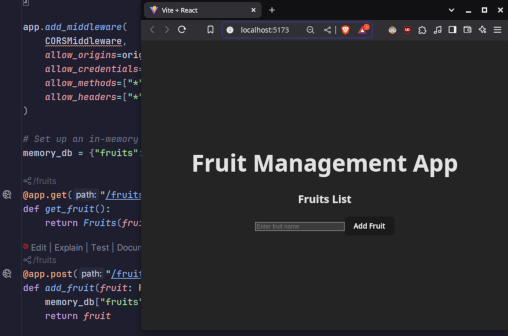

# Fast API - Python Backend & React Frontend

### Basic Full Stack web app demo.

#### Example of tying together a Python API backend with a React Frontend

### TODO:

**1. CI/CD this repo with GitLab** 

**2. Add a list of API Development Best Practices**

**Add one or more of the following request methods**

[ ] OPTIONS

[ ] PATCH

[ ] PUT

 

**Reference**

https://developer.mozilla.org/en-US/docs/Web/HTTP/Methods